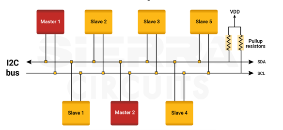
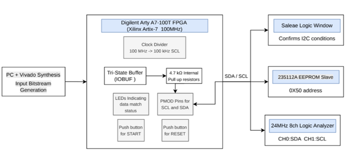
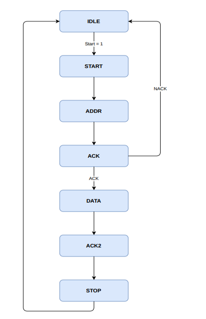
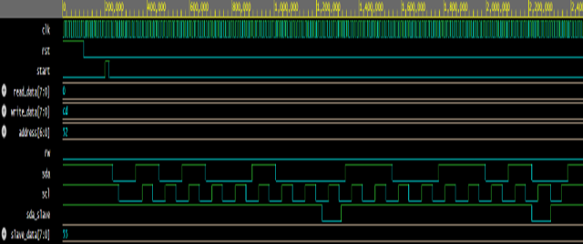
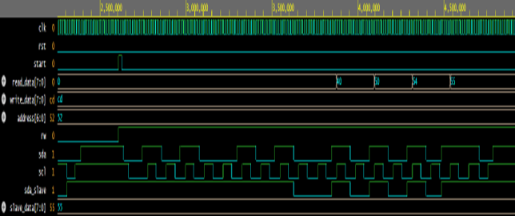
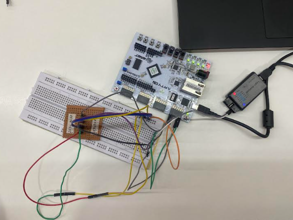
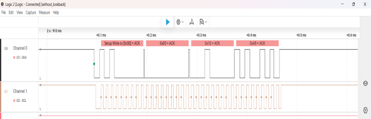
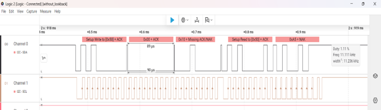

# FPGA-Based I2C Master with EEPROM Interface Using Verilog

## Overview

This project presents the design, simulation, and FPGA implementation of an I2C Master Controller using Verilog HDL. The controller was designed using a Finite State Machine (FSM) architecture and implemented on a Digilent Arty A7-100T FPGA board. The system interfaces with a 24512A EEPROM device through the I2C protocol and supports both EEPROM write and read operations.

The design was first verified through simulation and later deployed on FPGA hardware, where communication was validated using a Logic Analyzer and Saleae Logic 2 software.

## Features

- FSM-Based I2C Master Controller
- 7-Bit Slave Addressing
- EEPROM Read and Write Operations
- ACK/NACK Detection
- Repeated START Condition Support
- Tri-State SDA Communication
- Clock Divider for SCL Generation
- FPGA Hardware Implementation
- Logic Analyzer Verification
- Read-Back Data Verification

## Hardware Used

- Digilent Arty A7-100T FPGA Board
- 24512A EEPROM
- 24 MHz 8-Channel USB Logic Analyzer
- Breadboard and Connecting Wires
- USB Programming Cable

## I2C Bus Architecture

## System Architecture

## Clock Architecture

The FPGA board provides a 100 MHz system clock. A clock divider is implemented to generate a standard 100 kHz I2C clock (SCL) required for EEPROM communication.

## FSM Diagram

### FSM States

1. IDLE
2. START
3. ADDR
4. ACK
5. DATA
6. ACK2
7. STOP

## EEPROM Interfacing

The FPGA communicates with a 24512A EEPROM using the I2C protocol.

### Write Operation

- Generate START condition
- Send EEPROM address with write bit
- Send memory address
- Send data byte
- Receive acknowledgements
- Generate STOP condition

### Read Operation

- Generate START condition
- Send EEPROM address with write bit
- Send memory address
- Generate Repeated START
- Send EEPROM address with read bit
- Receive stored data
- Generate STOP condition

## Simulation Results

### Write Operation

### Read Operation

The simulation verifies successful address transmission, acknowledgement detection, data transfer, and protocol-compliant I2C communication.

## FPGA Hardware Setup

The validated design was implemented on a Digilent Arty A7-100T FPGA board and interfaced with a 24512A EEPROM for real-time hardware testing.

## Logic Analyzer Verification

### EEPROM Write Operation

### EEPROM Read Operation

The captured waveforms confirm successful START and STOP conditions, EEPROM addressing, acknowledgements, repeated START generation, and correct read/write operations.

## Tools Used

- EDA Playground
- Xilinx Vivado Design Suite
- Digilent Arty A7-100T FPGA Board
- Saleae Logic 2 Software
- USB Logic Analyzer

## Project Report

A comprehensive report documenting the complete design flow, simulation, FPGA implementation, EEPROM interfacing, hardware setup, and verification results is available in the report folder.

## Author

Dharmi Patel
